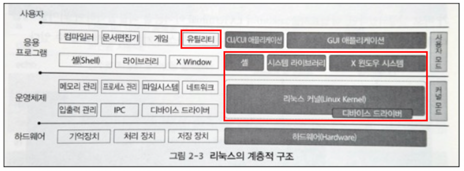

# Chapter2 : 리눅스의 기초

## 1. 리눅스의 탄생과 역사에 대해서 설명하시오.

- 리눅스는 1991년 핀란드의 리누스 토발즈가 리눅스 커널 0.1을 인터넷에 공개한 이후로 많은 해커들의 노력으로 함께 발전해온 운영체제이다.
- 리눅스의 개발은 인텔의 80386에서 시작되었지만 인터넷 공개 몇 년 후부터 Alpha, MIPS, ARM 등의 다양한 CPU를 지원할 수 있도록 포팅되었다.
- 현재 세계에서 가장 많이 사용되는 운영체제로 데스크톱부터 임베디드, 안드로이드 같은 스마트폰과 스마트 TV, 웨어러블 디바이스, 스마트카 등 다양한 사물인터넷의 중요한 플랫폼들을 지원한다.

---

## 2. 리눅스와 유닉스에 대해서 설명하고 관련된 표준에 대해서 설명하시오.

- 리눅스와 유닉스
    - 사실 리눅스가 유닉스에서 파생된 운영체제라 대부분 엇비슷하다. 따라서 차이점으로 정리하자면,
        
        
        |  | 유닉스 | 리눅스 |
        | --- | --- | --- |
        | 운영체제 | 서버에 특화된 운영체제 | 유닉스에서 파생된 운영체제 |
        | 장점 | 포털이나 대기업의 서버에 사용되며 보안성이 뛰어남 | 리눅스 운영체제 소스코드를 무료로 배포 |
        | 대표OS | Oracle Solaris | Ubuntu, RedHat |
        | 관리방식 | OS 코드가 공개되어있지 않아 버그 이슈같은 경우 IBM사에서 일괄 관리 | 오픈 소스이기 때문에 버그가 발생하면 많은 기관, 사용자들이 나서서 보완 |
        
- 단일 유닉스 규격(SUS, Single UNIX Specification)
    - 컴퓨터 운영체제가 유닉스라는 이름을 사용하기 위해 지켜야하는 표준의 총칭.
    - 운영체제와 사용자 및 소프트웨어 인터페이스를 다음과 같이 구분한다.
        - 기본 정의(Base Definitions) : C 언어의 헤더파일 규격
        - 쉘과 유틸리티(Shell and Utilities) :  쉘과 유틸리티(명령어) 규격
        - 시스템 인터페이스(System Interfaces) : 시스템 호출 및 C 라이브러리의 목록 규격
        - 해설(Rationale) : 단일 유닉스 규격의 표준에 대한 해설
    - 오픈소스인 BSD와 리눅스는 기능적인 면에서는 단일 유닉스 규격을 지원하고 있지만, 단일 유닉스 규격의 인증 유지를 위한 대표 기관이 없으므로 규격에 등록되어 있지 않다.
        
        ⇒ 규격에 등록되지 않았다 = 인증비용이나 인증 유지를 위한 대표 회사 및 단체가 없다.
        
        ⇒ 기능적인 면에서 BSD계열 OS나 리눅스는 규격에 등록되어있지 않다 = 리눅스는 오픈소스 유닉스 계열 운영체제로써 거의 처음부터 인터넷을 통해서 상당 수의 자발적 이용자들에 의해 해킹되었고, 엄격한 기준이나 관리 없이 수백 명으로부터 피드백을 받아 매주 릴리즈하며 탄생되었기 때문에 대표 회사 및 단체가 없다. 따라서 누구든지 개별 라이센스에 따라 상업적, 비상업적 이용, 수정, 배포가 가능하다.
        
        ⇒ 단일 유닉스 규격에 등록, 인증된 운영체제
        
        ex) 맥 OS X(현 macOS) : 유닉스 상표권 소유하며 유닉스 표준을 만든 오픈그룹으로 부터 유닉스 인증을 받아 기술적으로도 법률적으로도 완벽하게 유닉스 기준 충족.
        

---

## 3. 운영체제가 제공해야 하는 주요 역할에 대해서 설명하시오.

- multi-user : 동시에 여러 사람이 한꺼번에 사용할 수 있는 시스템이어야 한다.
- multi-process : 여러 프로그램을 실행할 수 있는 멀티프로세스 환경을 지원한다.
- multi-core & multi-processor : 멀티코어와 다중 CPU를 지원하는 멀티프로세서 시스템을 지원한다.

---

## 4. 리눅스의 특징과 구조에 대해서 설명하시오.

- 리눅스의 특징
    - 단일 유닉스 규격(SUS)을 지원하기 때문에 다른 유닉스에서 개발된 애플리케이션을 쉽게 사용할 수 있으며, X 윈도 시스템과 같은 유닉스의 표준GUI 시스템이 지원된다.
    - 여러 사용자들이 동시에 사용할 수 있는데, 각각의 사용자는 자신의 계정과 비밀전호를 이용해서 사용자를 구분하며, 계정 별로 접근 권한의 제약을 둠으로써 기본적인 시스템 보안을 제공한다.
- 리눅스의 구조
    
    
    
    - 커널
        - 중심부, 핵심. OS를 구성하는 기본적인 토대로서 시스템의 가장 기본적인 메모리나 프로세스 등의 하드웨어를 관리한다.
        - 애플리케이션이 커널을 이용할 수 있도록 시스템 호출과 같은 API(Application Programming Interface) 제공한다.
        - 커널은 하드웨어의 제어를 위한 디바이스 드라이버를 포함한다.
        
        <aside>
        💡 쉘은 사용자가 내린 명령을 커널이 이해할 수 있도록 번역해준다. 즉, 실질적으로는 커널이 명령 수행 및 하드웨어를 조작한다.
        
        </aside>
        
    - 유틸리티
        - 사용자는 콘솔이나 터미널과 같은 셸(CLI, Command Line Interface)을 사용하여 다양한 유틸리티를 실행하며 리눅스를 사용할 수 있다.
        - 유틸리티는 커널에서 제공하는 시스템 호출 인터페이스를 통해 커널과 통신할 수 있다.
    - X 윈도우 시스템
        - 리눅스에서 지원하는 유닉스의 표준 GUI 시스템 → 라즈베리파이 부팅 완료 시 화면이라고 생각하면 됨.

---

## 5. 리눅스 커널과 GNU 유틸리티의 관계에 대해서 설명하시오.

- 커널 위에 GNU에서 개발한 다양한 리눅스 유틸리티 및 glibc (GNU프로젝트가 C표준 라이브러리를 구현한 것)와 같은 다양한 라이브러리들이 위치한다.

---

## 6. 유닉스의 셸과 프롬프트에 대해서 설명하시오.

- 셸(Shell)
    - 커널의 바깥쪽에 위치하며 사용자와 커널 사이의 인터페이스로 사용자는 셸을 통해서 입력한 명령어를 수행할 수 있다.
    - 라즈베리파이에서는 터미널을 이용하여 리눅스의 기본 셸을 사용한다.
- 프롬프트(Prompt)
    - 위와 같이 $뒤에 커서가 표시되며 사용자 입력을 기다리고 있는 것을 유닉스 셸 프롬프트라고 한다.
    - 프롬프트는 컴퓨터가 입력을 기다리고 있음을 가리키기 위해 화면에 나타나는 표시이다.

---

## 7. 리눅스의 내장 명령어와 외부 명령어인 유틸리티의 차이점에 대해서 설명하시오.

- 내장 명령어는 셸에서 제공하는 명령어이고, 유틸리티는 사용자의 편의를 위해 시스템에서 제공하는 프로그램이다.
- 일반적으로 유틸리티는 외부에 별도의 실행 파일로 제공되는데, 셸이 프로그램 파일의 내용을 메모리로 로드하여 수행한다.

⇒ 명령체계의 효율성 때문에 사용자 편리를 위하여 구분해놓았다. ls, cd와 같은 명령어는 1분에도 몇 차례씩 사용할 정도로 사용 빈도가 높다. 이 명령어들을 각 명령어 파일로 만들어 디스크에 저장해놓았다면, 매번 명령어를 실행할 때마다 디스크에 저장된 파일을 찾고 램으로 불러와야하므로 매우 비효율적이다. 따라서 사용 빈도가 높은 명령어들을 하나의 파일로 묶고 부팅할 때 디스크에서 읽어 램에 상주시킨다. 이것이 내부명령어이다.  ex) ls, cd, mv, rm, cp etc...

⇒ 도스의 운영체제 파일 중 사용 빈도가 낮고 중요하지 않는 명령어는 외부명령어로 존재한다. 즉, 디스크에 파일로 저장해두었다가 부팅이 된 후 필요할 때마다 디스크에서 읽어 램으로 불러와 실행시킨다. 

ex) mke2fs, fdisk etc...

---

## 8. 유닉스의 디렉터리 구조와 관련 유틸리티들에 대해서 설명하시오.

- 유닉스의 디렉터리 구조
    
    
    
    - 트리 구조의 파일 시스템
    - 데이터를 저장하는 가장 기본적인 단위가 파일이며 파일은 디렉터리 안에 위치한다.
- 관련 유틸리티
    - 파일의 압축과 해제 : tar 명령어
    - 검색
        - 파일명으로 파일 위치 검색하기 : find 명령어
        - 파일 내용으로 파일 검색하기 : grep

질문 : 다들 유틸리티를 어떻게 이해했는지 궁금! ⇒ 유틸리티 = 명령어

---

## 9. vi 에디터의 모드와 모드 변환에 대해서 설명하시오.

- 크게 3가지 모드를 가지며, 처음 실행하면 명령모드로 실행된다.
- 입출력 장치의 느린 속도 문제 해결을 위해 버퍼를 사용하여 문서의 내용을 편집하므로 저장 명령을 사용하기 전까지는 작업 취소 및 변경이 자유롭다.
    
    
    
    <aside>
    💡 vi 에디터 명령어 모음집 참고(pdf) :
    
    [VIM / VI 명령어 정리](https://blog.naver.com/PostView.nhn?blogId=whentlr&logNo=120190072015&parentCategoryNo=&categoryNo=38&viewDate=&isShowPopularPosts=false&from=postView)
    
    </aside>
    

---

## 10. 리눅스의 기본 컴파일러에 대해서 설명하고 C언어로 된 소스 코드가 실행 파일로 빌드되는 과정에 대해서 설명하시오.

- 리눅스 기본 컴파일러 : GCC (GNU C Compiler)
- 빌드되는 과정은 크게 총 4단계로 진행됨.
    - 1 단계 : 전처리기 단계
        - main.c, sub.c 소스파일에서 #include, #define과 같이 #으로 시작되는 지시자들에 대한 처리를 한다.
        - #include “stdio.h” 코드가 있으면 시스템에서 stdio.h파일을 읽어와 해당 소스파일에 그래도 삽입시킨다. 전처리가 완료되면 파일 이름 뒤에 .i가 붙어서 저장된다.
    - 2 단계 : 컴파일 단계
        - main.i 파일을 읽어와 어셈블리언어로 변환하여 .s 파일을 생성한다.
    - 3 단계 : 어셈블리 단계
        - main.s의 내용을 더욱 쪼개서 instruction 단위로 만들고 이것을 한데모아 재배치가능한 목적프로그램 단위로 묶어 .o 파일을 만든다.
        - 재배치가능한 = 다른 목적파일들과 결합이 가능한 ⇒ 소스코드 일부가 변경되었을 때 전체 컴파일을 새로 수행하는 대신, 해당 목적 파일만 생성하고 교체하면 되기 때문에 컴파일의 효율성이 높아짐.
    - 4 단계 : 링킹 단계
        - 외부의 라이브러리를 참조한다.  ex) 정적 라이브러리, 공유 라이브러리 etc..
        - printf와 같은 함수는 표준 C 라이브러리에 포함되어 printf.o 목적파일 형태로 제공된다. main.o와 printf.o를 결합해야만 프로그램이 정상적으로 작동한다.

---

## 11. makefile의 기본 구조와 주의 사항을 설명하시오.

- makefile의 기본구조
    
    
    
    - 목표(targetList) : 명령이 수행되어 생성될 결과 파일(목적파일 혹은 실행파일)을 지정한다.
    - 의존 관계(dependencyList) : 목표를 수행하기 위해 필요한 의존 관계를 설정한다.
    - 명령(commandList) : 의존 관계에 정의된 파일의 내용이 변경되었거나 목표에 해당하는 파일이 없을 때 정의된 내용이 차례대로 실행된다.
- 주의 사항
    - 명령의 앞부분은 반드시 탭(TAB) 문자로 시작해야 하며, 공백(빈칸) 등의 다른 문자를 사용하면 make 실행 중 에러가 발생한다.
    
    <aside>
    💡 vi 에디터 탭 사이즈 줄이기 : [http://www.fun25.co.kr/blog/linux-vi-setting-tab-size](http://www.fun25.co.kr/blog/linux-vi-setting-tab-size) 
    ⇒ vimrc : 줄번호 기타 설정파일... (정현씨 고수)
    
    </aside>
    

---

## 12. 디버깅에 대해서 설명하고 gdb의 기본 사용법에 대해서 설명하시오.

- 디버깅 : De + bug + ing 을 직역하면 벌레를 제거과하는 과정으로, 작성한 프로그램이 의도대로 작동하지 않을 때 잘못된 부분을 찾아내는 과정이다.
- gdb 유틸리티
    - 중단점(Breakpoint) 사용 가능
    - 해당 지점의 변수, 포인터 값 등 내부 상태 조사 가능
    - ‘gdb [프로그램명]’ 으로 디버깅 가능
    
    
    

---

## 13. 유닉스의 라이브러리에 대해서 설명하고 생성할 때 사용되는 명령어는 무엇인지 기술하시오.

- 유닉스 사용 라이브러리
    - 정적 라이브러리(.a) : 링크 시 실행 파일에 포함되지만, 공유 라이브러리는 포함되지 않는다.
    - 공유 라이브러리(.so) : 공유 라이브러리를 사용하는 애플리케이션은 실행 시 메모리 내에 해당 공유 라이브러리들이 있는지 확인하고, 메모리에 없는 경우 ‘/lib’나 ‘/usr/lib’ 등의 디렉터리나 LD_LIBRARY_PATH 같은 환경 변수를 검색하여 메모리로 로드한 후 실행된다.
- 명령어 종류
    - ar 유틸리티 : 기존의 라이브러리를 조회하고 새로운 라이브러리를 생성하거나 라이브러리에서 목적 파일을 제거하는 등 옵션을 통해 여러 액션 가능
    - ranlib 유틸리티 : 라이브러리에 포함된 객체들의 아카이브 인덱스를 작성하는데, 아카이브 인덱스는 소스 코드 빌드 과정에서 링크 시 작업을 보다 빠르게 진행할 수 있도록한다.
    - nm 유틸리티 : 라이브러리에서 해당 객체의 심볼과 연관된 이름이나 타입 등의 정보를 출력해준다.

---

참조 :

- ARM 아키텍처 : [https://m.blog.naver.com/PostView.naver?isHttpsRedirect=true&blogId=suresofttech&logNo=221249244004](https://m.blog.naver.com/PostView.naver?isHttpsRedirect=true&blogId=suresofttech&logNo=221249244004)
- 유닉스/리눅스 차이1 : [https://kkhipp.tistory.com/148](https://kkhipp.tistory.com/148)
- 유닉스/리눅스 차이2 : [https://codaa.tistory.com/481](https://codaa.tistory.com/481)
- GNU/GPL : [https://jhnyang.tistory.com/18](https://jhnyang.tistory.com/18)
- 내부명령어/외부명령어 : [https://sonseungha.tistory.com/295](https://sonseungha.tistory.com/295)
- 리눅스 명령어/도스 명령어 비교 : [https://beone.tistory.com/242](https://beone.tistory.com/242)
- GCC 컴파일러 : [https://frontjang.info/entry/GCC-컴파일러에-대해-1-컴파일러의-4가지-단계](https://frontjang.info/entry/GCC-%EC%BB%B4%ED%8C%8C%EC%9D%BC%EB%9F%AC%EC%97%90-%EB%8C%80%ED%95%B4-1-%EC%BB%B4%ED%8C%8C%EC%9D%BC%EB%9F%AC%EC%9D%98-4%EA%B0%80%EC%A7%80-%EB%8B%A8%EA%B3%84)
